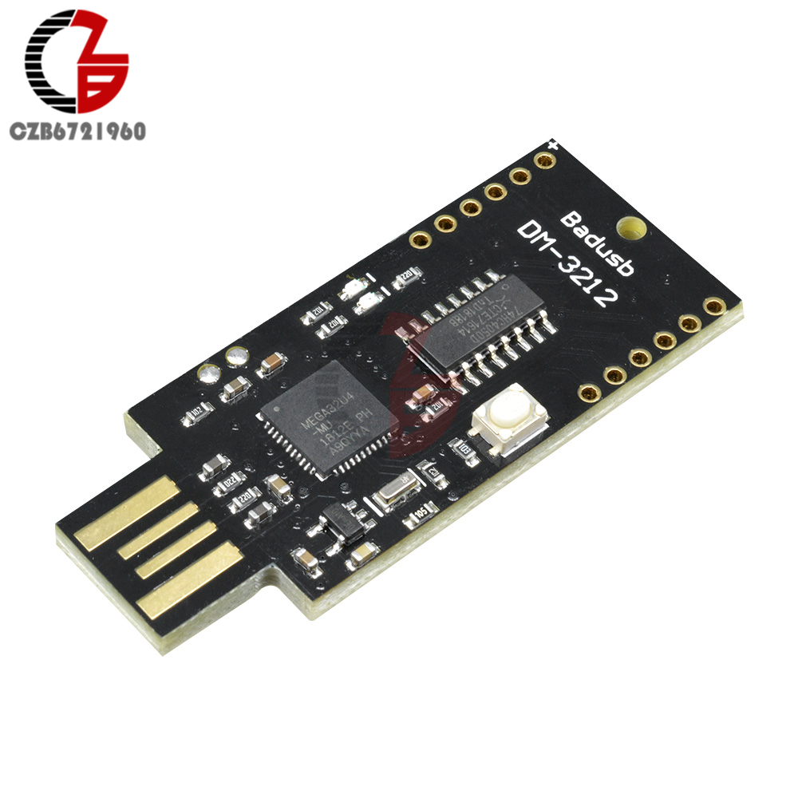

# General

Got a DM-3212 Badusb, based on a AtMega32u4 with an ESP-12E (8266) module.


source: https://github.com/robertio/DM-3212-Badusb

But without any schematics and pinout documentation this meeds a bit reverse engineering on getting it to work.

This documentation describes the steps for getting the AtMega32u4 to work/flash it and how to flash the ESP module on the back of the board.

# Using the AtMega32u4

The AtMega part has the default LED on pin 13, **and an additional LED on pin 8**. This could be handy if you want to use the LEDs.
I've included an test script in [scripts/blink-dm-3212.ino](scripts/blink-dm-3212.ino)

I started with the manual of SpaceHuhn, documented here: https://wifiduck.com/docs/software/arduino

But uploading anything to the 'Leonardo' board included in the `Tools`>`Board` section caused an error:

```
upload.tool.serial is undefined
```

It seems this is related to the *boards.txt* file in the package.
The default blink example on a default leonardo board works well on the DM-3212 board.

I work on a Linux machine, so paths could be different depending on your OS.
Comparison of:

* `.arduino15/packages/arduino/hardware/avr/1.8.6/boards.txt`
* `.arduino15/packages/wifiduck/hardware/avr/1.8.5/boards.txt`

I only focussed on the 'Arduino Leonardo' configuration and added the following line:
```
leonardo.upload.tool.default=avrdude
```
The installed bootloader on the DM-3212 seemed to work just fine, if by anycase this needs reburning, we probably need a boards.txt adjustment as well, take a look at [Documentation.md](DOCUMENTATION.md)


# firmware ESP8266

It seems that multiple people already fixed this issue.
* https://github.com/puckk/CJMCU-3212/tree/master
* https://github.com/robertio/DM-3212-Badusb/tree/master

First solder a jumper mechanism (a joint, or a header) on the two solder pads. Connect them, and place it in your USB port.

* Burn the [Step1.ino](scripts/step1.ino) on the AtMega32u4, using the Arduino IDE.

This will passthrough the serial of the Leonardo to the serial of the ESP chip on the back. Now we can use this passthrough to connect to the serial of the ESP-12E module.

In the Arduino IDE

`Tools`>`Board` Select: NodeMCU 1.0 (ESP-12E Module) 

`Tools`> `Erase Flash` Select: Sketch + WiFi settings or a All Flass Contents

In libraryManager install the following libraries and their dependencies.
* SimpleCLI
* ESPAsyncTCP
* ESPAsyncWebServer
    * AsyncTCP
    * ESPAsyncTCP

Then open the esp_duck directory with the esp_duck.ino file.

**Important** before uploading, uncomment the following line in esp_duck/config.h:
```
#define ENABLE_SERIAL
```
This will enable the serial connection between the ESP-12E module and the AtMega32u4 on the side of the ESP module.
Then run **Upload** in the Arduino IDE, since the serial is in passthrough this don't need extra tooling and should work fine with the built-in esptool.py script.

# firmware AtMega32u4

The only thing we need to upload now is the firmware for the AtMega32u4 part of the board.
Open the atmega_duck.ino project and select the board you made the adjustments to in *boards.txt*, in my case the Arduino Leonardo board.
`Tools`>`Board`>`Wifi Duck AVR Boards`>`Arduino Leonardo`

**important** before uploading, uncomment the following lines in atmega_duck/config.h
```
// #define ENABLE_SERIAL
#define SERIAL_COM Serial1
#define SERIAL_BAUD 9600
```
This will enable the **Serial1** on the side of the AtMega connected to the ESP-12E module. This is used by the ESP to send commands to the AtMega such that they are can be send as HID commands.

# References

* https://github.com/puckk/CJMCU-3212/blob/master/step1.ino for step1.ino
* https://github.com/robertio/DM-3212-Badusb/blob/master/README.md also same issues that use step1.ino
* https://github.com/SpacehuhnTech/WiFiDuck/issues/30#issuecomment-644378423 for post of michalmonday
* https://github.com/SpacehuhnTech/WiFiDuck?tab=readme-ov-file#flash-atmega32u4 for this project
* https://wifiduck.com/docs/cli some terminal commands 